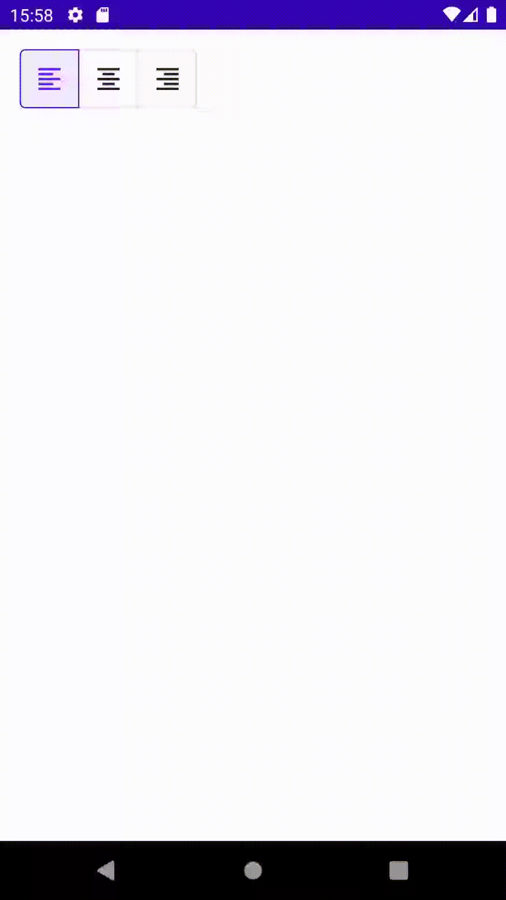

# ComposeToggleButton



```kotlin
enum class FormatAlign(
    val imageVector: ImageVector,
    val contentDescription: String
) {
    LEFT(Icons.Default.FormatAlignLeft, "align horizontal left"),
    CENTER(Icons.Default.FormatAlignCenter, "align horizontal center"),
    RIGHT(Icons.Default.FormatAlignRight, "align horizontal right")
}

@Composable
fun FormatAlignToggleButton() {
    var selected by remember { mutableStateOf(FormatAlign.LEFT) }

    val values = FormatAlign.values()
    val itemCount = values.size

    IconToggleButtonGroup(selected.ordinal, itemCount) { index ->
        val align = values[index]
        IconToggleButton(
            imageVector = align.imageVector,
            contentDescription = align.contentDescription,
            checked = selected == align,
            onCheckedChange = { selected = align },
        )
    }
}
```
